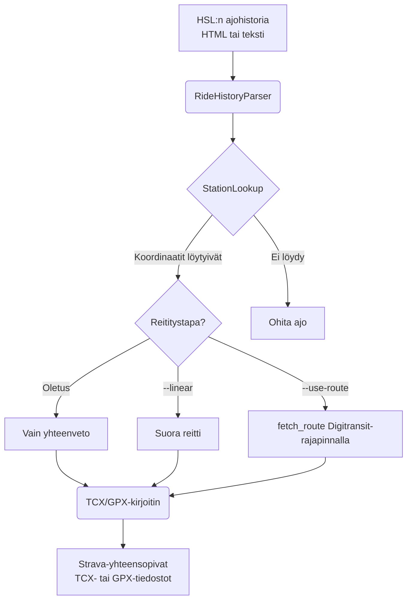

# HSL Kaupunkipyörä Exporter

[](./README.md)
[](./README.fi.md)
[](./README.sv.md)

Muuta [HSL:n kaupunkipyörien](https://www.hsl.fi/omat-tiedot/kaupunkipyorat/matkahistoria) ajohistoriasi
Strava-yhteensopiviksi TCX- tai GPX-tiedostoiksi.

## Asennus

Vaaditaan Python 3.13+. Helpoin tapa ajaa työkalu on [`uvx`](https://docs.astral.sh/uv/):llä:

```bash
uvx hsl-kaupunkipyora-exporter rides.txt
```

Tai asenna `pip`:llä:

```bash
pip install hsl-kaupunkipyora-exporter
hsl-kaupunkipyora-exporter rides.txt
```

## Tekoälyagentin skilli

Tässä repossa on [skilli](skills/hsl-bike-export/SKILL.md), jonka avulla tekoälyagentit, kuten Claude Code, voivat
käyttää työkalua luonnollisella kielellä: se muuttaa pyynnöt, kuten ”vie ajoni GPX-muodossa”, oikeiksi
komentorivivalitsimiksi ja tarjoutuu hakemaan ajohistoriasivun suoraan selaimen kautta (esim. Claude in Chrome), kun
annat siihen luvan. Ohjeet viittaavat Claude Coden omiin työkaluihin (`ToolSearch`, `Bash`, `Write`), joten skilli on
toistaiseksi Claude Code -kohtainen, vaikka se asennetaan [`skills`](https://github.com/vercel-labs/skills)-työkalulla,
joka tukee muitakin agentteja. Tämän repon `skills/`-hakemisto on virallinen versio; asennus kopioi sen omaan
projektiisi hakemistoon `.claude/skills/`. Asenna se projektiisi esimerkiksi näin:

```bash
npx skills add nikosavola/hsl-kaupunkipyora-exporter
```

## Käyttö

1. Avaa ajohistoriasi osoitteessa <https://www.hsl.fi/omat-tiedot/kaupunkipyorat/matkahistoria>.
1. Tallenna sivu HTML-tiedostona (`Ctrl+S`) **tai** kopioi ajohistorian osuus `.txt`-tekstitiedostoon.
1. Aja työkalu:

```bash
uvx hsl-kaupunkipyora-exporter rides.html
```

### Reititystavat

HSL Kaupunkipyörä Exporter tukee kolmea eri tapaa reitittää paikkatiedot:

1. **Vain yhteenveto (oletus)**: Tuottaa TCX-tiedoston, joka sisältää HSL:n ilmoittaman matkan ja keston, mutta ei
   GPS-reittipisteitä. Tämä on tarkin tapa kirjata kilometrit Stravaan ilman reitin arvaamista.
1. **Suora reitti (`--linear`)**: Tuottaa suoran viivan lähtö- ja palautusaseman välillä. Hyödyllinen, jos haluat
   yksinkertaisen visualisoinnin kartalle.
1. **Reititetty polku (`--use-route`)**: Hakee ehdotetun pyöräilyreitin
   [Digitransit-rajapinnasta](https://digitransit.fi/en/developers/apis/). Tämä tarjoaa realistisen reitin kartalla sekä
   säilyttää HSL:n antaman matkan ja keston (TCX:ää käytettäessä). Vaatii
   [ilmaisen API-avaimen](https://digitransit.fi/en/developers/api-registration/).

### Valinnat

| Lippu                | Kuvaus                                                                         |
| -------------------- | ------------------------------------------------------------------------------ |
| `--output-dir DIR`   | Hakemisto, johon tiedostot kirjoitetaan (oletus: `./tcx_output`)               |
| `--format FMT`       | Tiedostomuoto: `tcx` (oletus) tai `gpx`.                                       |
| `--linear`           | Käytä suoraa viivaa asemien välillä                                            |
| `--use-route`        | Käytä HSL:n ehdottamaa pyöräilyreittiä suoran viivan sijaan                    |
| `--api-key KEY`      | Digitransit API -avain (vaihtoehto `DIGITRANSIT_API_KEY`-ympäristömuuttujalle) |
| `--refresh-stations` | Pakota pyöräasemien koordinaattilistan uudelleenlataus                         |
| `-v`, `--verbose`    | Ota käyttöön laajennettu/debug-lokitus                                         |

### TCX vs GPX

Vaikka GPX on yleisin tiedostomuoto, se ei tue ajetun kokonaismatkan antamista. Strava laskee matkan annettujen
GPS-pisteiden perusteella.

**TCX** on suositellumpi tiedostomuoto, koska sen avulla kaupunkipyörän antama etäisyyslukema pysyy tiedostossa
GPS-reitistä riippumatta.

```bash
# Tuota TCX-tiedosto suoralla viivalla asemien välillä
uvx hsl-kaupunkipyora-exporter rides.txt --format tcx --linear
```

### Reititetyn polun asetus

Käyttääksesi HSL:n ehdottamaa todellista pyöräilyreittiä tarvitset Digitransit API -avaimen:

1. Rekisteröidy ilmaiseksi osoitteessa
   [Digitransit Developer Portal](https://digitransit.fi/en/developers/api-registration/).
1. Anna avain `--api-key`-lipulla tai `DIGITRANSIT_API_KEY`-ympäristömuuttujalla.

```bash
uvx hsl-kaupunkipyora-exporter rides.txt --use-route --api-key AVAIMESI_TÄHÄN
```

### Kilometrikisa

Tämä on kätevä tapa lisätä **Alepa Fillari** -kilometrit [Kilometrikisaan](https://www.kilometrikisa.fi/) tuomalla ajot
ensin Stravaan.

## Arkkitehtuuri



## Kehittäminen

Käytä [`just`](https://github.com/casey/just)-työkalua komentojen suorittamiseen.

```bash
git clone https://github.com/nikosavola/hsl-kaupunkipyora-exporter.git
cd hsl-kaupunkipyora-exporter
just install
just test
```
