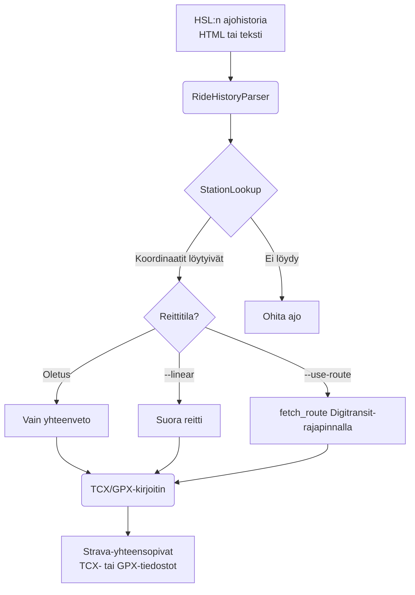

# HSL Kaupunkipyörä Exporter

[](./README.md)
[](./README.fi.md)
[](./README.sv.md)

Jäsennä [HSL:n kaupunkipyörien](https://www.hsl.fi/omat-tiedot/kaupunkipyorat/ajohistoria) ajohistoriasi ja vie jokainen
ajo Strava-yhteensopivana TCX- tai GPX-tiedostona.

## Asennus

Vaatii Python 3.13+. Helpoin tapa ajaa työkalu on [`uvx`](https://docs.astral.sh/uv/):llä:

```bash
uvx hsl-kaupunkipyora-exporter rides.txt
```

Tai asenna `pip`:llä:

```bash
pip install hsl-kaupunkipyora-exporter
hsl-kaupunkipyora-exporter rides.txt
```

## Käyttö

1. Avaa ajohistoriasi osoitteessa <https://www.hsl.fi/omat-tiedot/kaupunkipyorat/ajohistoria>.
1. Tallenna sivu HTML-tiedostona (`Ctrl+S`) **tai** kopioi näkyvä teksti `.txt`-tiedostoon.
1. Aja exporter:

```bash
uvx hsl-kaupunkipyora-exporter rides.html
```

### Reittitilat

Exporter tukee kolmea eri tilaa maantieteellisen datan käsittelyyn:

1. **Vain yhteenveto (oletus)**: Vie TCX-tiedoston, joka sisältää HSL:n ilmoittaman tarkan matkan ja keston, mutta ei
   GPS-reittipisteitä. Tämä on tarkin tapa kirjata kilometrit Stravaan ilman reitin arvaamista.
1. **Suora reitti (`--linear`)**: Sisältää yksinkertaisen kahden pisteen suoran viivan lähtö- ja palautusaseman välillä.
   Hyödyllinen, jos haluat perusvisualisoinnin kartalle.
1. **Reititetty polku (`--use-route`)**: Hakee ehdotetun pyöräilyreitin
   [Digitransit-rajapinnasta](https://digitransit.fi/kehittajille/rajapinnat/). Tämä tarjoaa realistisen reitin kartalla
   ja säilyttää HSL:n matkatiedot (TCX:ää käytettäessä). Vaatii
   [ilmaisen API-avaimen](https://digitransit.fi/kehittajille/api-rekisteroityminen/).

### Valinnat

| Lippu                | Kuvaus                                                                 |
| -------------------- | ---------------------------------------------------------------------- |
| `--output-dir DIR`   | Hakemisto, johon tiedostot kirjoitetaan (oletus: `./tcx_output`)       |
| `--format FMT`       | Vientimuoto: `tcx` (oletus) tai `gpx`.                                 |
| `--linear`           | Sisällytä suora viiva asemien välillä                                  |
| `--use-route`        | Käytä HSL:n ehdottamaa pyöräilyreittiä suoran viivan sijaan            |
| `--api-key KEY`      | Digitransit API -avain (vaihtoehto `DIGITRANSIT_API_KEY`-ympäristömuuttujalle) |
| `--refresh-stations` | Pakota pyöräasemien koordinaattilistan uudelleenlataus                 |
| `-v`, `--verbose`    | Ota käyttöön laajennettu/debug-lokitus                                 |

### TCX vs GPX

Vaikka GPX on yleisin muoto, se ei tue eksplisiittistä "kokonaismatkan" ohitusta. Strava laskee matkan annettujen
GPS-pisteiden perusteella.

**TCX** on oletus- ja suositeltu muoto, koska sen avulla työkalu voi kertoa Stravalle tarkalleen, kuinka monta
kilometriä ajo oli, GPS-reitistä riippumatta.

```bash
# Vie TCX-muotoon suoralla viivalla asemien välillä
uvx hsl-kaupunkipyora-exporter rides.txt --linear
```

### Reititetyn polun asetus

Käyttääksesi HSL:n ehdottamaa todellista pyöräilyreittiä tarvitset Digitransit API -avaimen:

1. Rekisteröidy ilmaiseksi osoitteessa [Digitransit Developer Portal](https://digitransit.fi/kehittajille/api-rekisteroityminen/).
1. Anna avain `--api-key`-lipulla tai `DIGITRANSIT_API_KEY`-ympäristömuuttujalla.

```bash
uvx hsl-kaupunkipyora-exporter rides.txt --use-route --api-key avaimesi_tahan
```

### Kilometrikisa

Tämä on kätevä tapa lisätä **Alepa Fillari** -kilometrit [Kilometrikisaan](https://www.kilometrikisa.fi/) tuomalla ajot
ensin Stravaan.

## Miten se toimii



## Kehitys

Käytä [`just`](https://github.com/casey/just)-työkalua tehtävien ajamiseen.

```bash
git clone https://github.com/nikosavola/hsl-kaupunkipyora-exporter.git
cd hsl-kaupunkipyora-exporter
just install
just test
```
