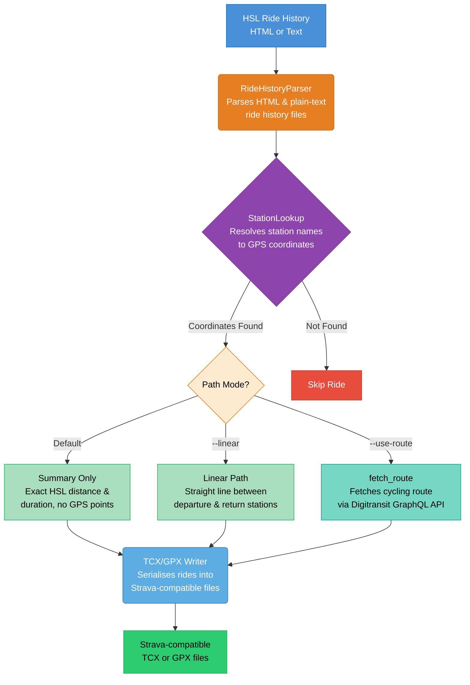

# HSL Kaupunkipyörä Exporter

[](./README.md)
[](./README.fi.md)
[](./README.sv.md)

Parse your [HSL City Bike](https://www.hsl.fi/en/my-information/citybikes/ride-history) ride history and export each
ride as a Strava-compatible TCX or GPX file.

## Installation

Requires Python 3.13+. The easiest way to run the tool is via [`uvx`](https://docs.astral.sh/uv/):

```bash
uvx hsl-kaupunkipyora-exporter rides.txt
```

Or install with `pip`:

```bash
pip install hsl-kaupunkipyora-exporter
hsl-kaupunkipyora-exporter rides.txt
```

## Usage

1. Open your ride history at <https://www.hsl.fi/en/my-information/citybikes/ride-history>.
1. Save the page as HTML (`Ctrl+S`) **or** copy-paste the visible text into a `.txt` file.
1. Run the exporter:

```bash
uvx hsl-kaupunkipyora-exporter rides.html
```

### Path Modes

The exporter supports three distinct modes for handling geographic data:

1. **Summary Only (Default)**: Exports a TCX file containing the exact distance and duration reported by HSL, but no GPS
   trackpoints. This is the most accurate way to record kilometers in Strava without guessing the path.
1. **Linear Path (`--linear`)**: Includes a simple two-point straight line between the departure and return stations.
   Useful if you want a basic map visualization.
1. **Routed Path (`--use-route`)**: Fetches the suggested cycling route from the
   [Digitransit API](https://digitransit.fi/en/developers/apis/). This provides a realistic path on the map and
   preserves HSL distance data (when using TCX). Requires a
   [free API key](https://digitransit.fi/en/developers/api-registration/).

### Options

| Flag                 | Description                                                        |
| -------------------- | ------------------------------------------------------------------ |
| `--output-dir DIR`   | Directory to write files into (default: `./tcx_output`)            |
| `--format FMT`       | Export format: `tcx` (default) or `gpx`.                           |
| `--linear`           | Include a straight-line path between stations                      |
| `--use-route`        | Use suggested HSL cycling route instead of a straight line         |
| `--api-key KEY`      | Digitransit API key (alternative to `DIGITRANSIT_API_KEY` env var) |
| `--refresh-stations` | Force re-download of the bike station coordinate list              |
| `-v`, `--verbose`    | Enable verbose/debug logging                                       |

### TCX vs GPX

While GPX is the most common format, it does not support an explicit "total distance" override. Strava calculates
distance based on the GPS points provided.

**TCX** is the default and recommended format because it allows the tool to tell Strava exactly how many kilometers the
ride was, regardless of the GPS path.

```bash
# Export as TCX with a straight line between stations
uvx hsl-kaupunkipyora-exporter rides.txt --linear
```

### Routed Path Setup

To use the actual cycling route suggested by HSL, you need a Digitransit API key:

1. Register for a free key at [Digitransit Developer Portal](https://digitransit.fi/en/developers/api-registration/).
1. Provide the key via the `--api-key` flag or the `DIGITRANSIT_API_KEY` environment variable.

```bash
uvx hsl-kaupunkipyora-exporter rides.txt --use-route --api-key your_key_here
```

### Kilometrikisa

This is a convenient way to add your **Alepa Fillari** kilometers to [Kilometrikisa](https://www.kilometrikisa.fi/) by
importing your rides into Strava first.

## How it Works



## Development

Use [`just`](https://github.com/casey/just) to run tasks.

```bash
git clone https://github.com/nikosavola/hsl-kaupunkipyora-exporter.git
cd hsl-kaupunkipyora-exporter
just install
just test
```
